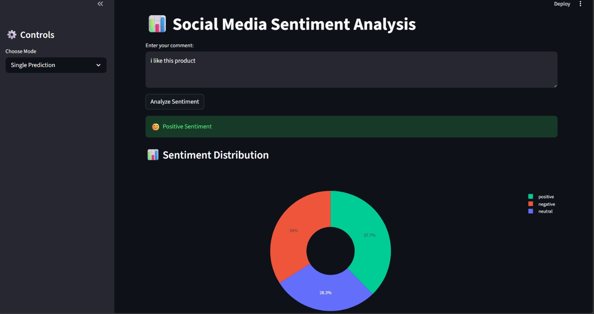
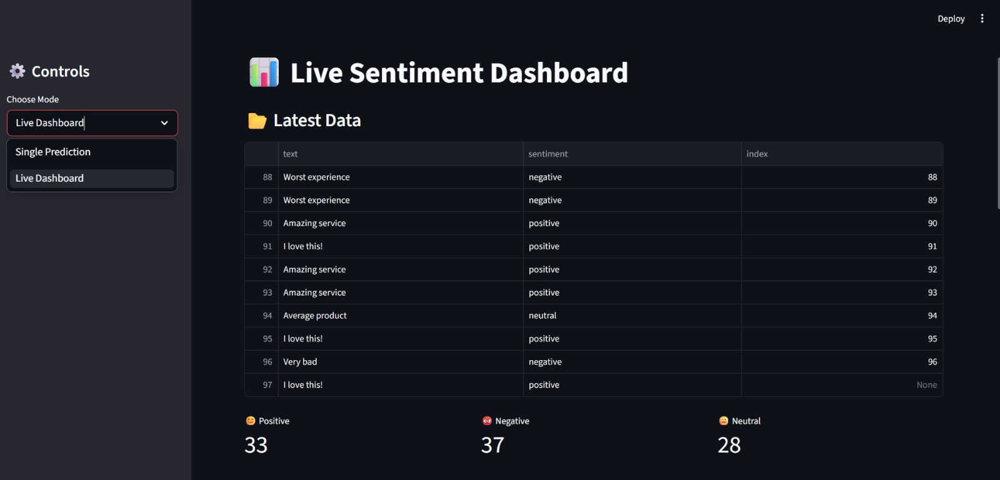
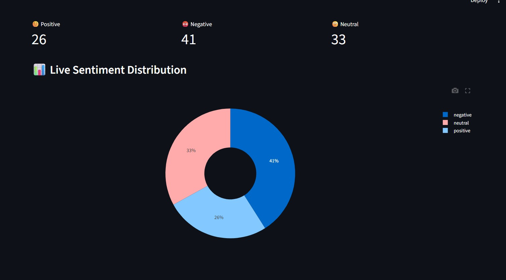
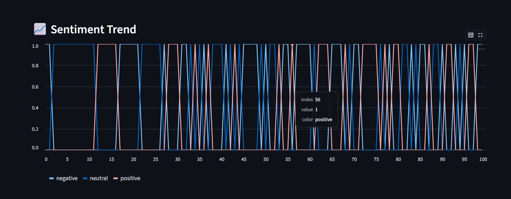

# 📊 Social Media Sentiment Analysis Dashboard

## 🚀 Project Overview

This project is a complete end-to-end **Machine Learning + NLP application** that analyzes sentiment from social media text and visualizes insights through an interactive dashboard.

The system classifies text into:

* 😊 Positive
* 😡 Negative
* 😐 Neutral

It also provides **real-time analytics, model evaluation, and visual insights** using an interactive Streamlit interface.

---

## 🎯 Problem Statement

Organizations receive massive amounts of feedback through social media platforms. Manually analyzing this data is inefficient and time-consuming.

This project solves that problem by:

* Automatically detecting sentiment from text
* Providing real-time insights
* Helping understand customer opinions and trends

---

## 💼 Industry Relevance

Sentiment analysis is widely used by:

* E-commerce platforms (Amazon, Flipkart)
* Food delivery apps (Zomato, Swiggy)
* Streaming platforms (Netflix)
* Banking & fintech companies
* Marketing & political campaigns

This project simulates a **real-world sentiment monitoring system** used by companies to:

* Track brand reputation
* Analyze customer feedback
* Improve products/services
* Monitor campaign performance

---

## ⚙️ Features

* 🔍 Single Text Sentiment Prediction
* 📊 Interactive Dashboard with Charts
* 🔄 Live Auto-Updating Sentiment Data
* 📈 Trend Analysis
* 📉 Confusion Matrix Visualization
* 📄 Classification Report Display
* 🌙 Dark-Themed Professional UI

---

## 🛠 Tech Stack

### Programming & Libraries

* Python
* Pandas, NumPy

### Machine Learning

* Scikit-learn
* TF-IDF Vectorization
* Logistic Regression

### NLP

* Text Cleaning & Preprocessing

### Visualization

* Plotly
* Matplotlib
* Seaborn

### Dashboard

* Streamlit

---

## 🏗️ Project Architecture

```
User Input / Dataset
        ↓
Text Cleaning & Preprocessing
        ↓
TF-IDF Feature Extraction
        ↓
Machine Learning Model (Logistic Regression)
        ↓
Sentiment Prediction
        ↓
Dashboard Visualization (Streamlit)
```

---

## 📂 Project Structure

```
Social-Media-Sentiment-Analysis-Dashboard/

├── data/
│   └── dataset.csv

├── src/
│   ├── preprocess.py
│   ├── train_model.py
│   └── predict.py

├── models/
│   └── model.pkl

├── app/
│   └── app.py

├── outputs/
│   ├── confusion_matrix.png
│   └── report.txt

├── requirements.txt
├── main.py
└── README.md
```

---

## ⚙️ Installation & Setup

### 1️⃣ Clone the repository

```bash
git clone https://github.com/YOUR-USERNAME/social-media-sentiment-dashboard.git
cd social-media-sentiment-dashboard
```

### 2️⃣ Install dependencies

```bash
pip install -r requirements.txt
```

---

## ▶️ How to Run

### Step 1: Train the model

```bash
python src/train_model.py
```

### Step 2: Run the dashboard

```bash
streamlit run app/app.py
```

---

## 📊 Dashboard Features

### 🧠 Single Prediction

* Enter any text
* Get instant sentiment prediction
* View updated sentiment distribution

### 📡 Live Dashboard

* Auto-refresh every 5 seconds
* Real-time sentiment updates
* Pie chart distribution
* Trend visualization

### 📉 Model Evaluation

* Confusion Matrix
* Classification Report

---

## 📸 Screenshots

> Add your screenshots in the `images/` folder

```
## 📸 Screenshots
```
### 📊 Dashboard





---
### 🧠 Prediction





### 📉 Confusion Matrix


```
---
```
## 📈 Results

* Accurate sentiment classification using ML
* Real-time visualization of sentiment trends
* Interactive and user-friendly dashboard

---

## 🧠 Learning Outcomes

* End-to-end ML pipeline development
* Natural Language Processing (NLP) basics
* Feature engineering using TF-IDF
* Model evaluation techniques
* Dashboard development using Streamlit

---

## 🚧 Future Improvements

* Use advanced NLP models (BERT, Transformers)
* Integrate real-time Twitter API
* Deploy on cloud (Streamlit Cloud / AWS)
* Add user authentication & filters

---

## 👩‍💻 Author

 Sakshi Maurya B.Tech in Information Technology at K.j. Somaiya institute of technology

---

## ⭐ If you like this project

Give it a ⭐ on GitHub and feel free to contribute!
